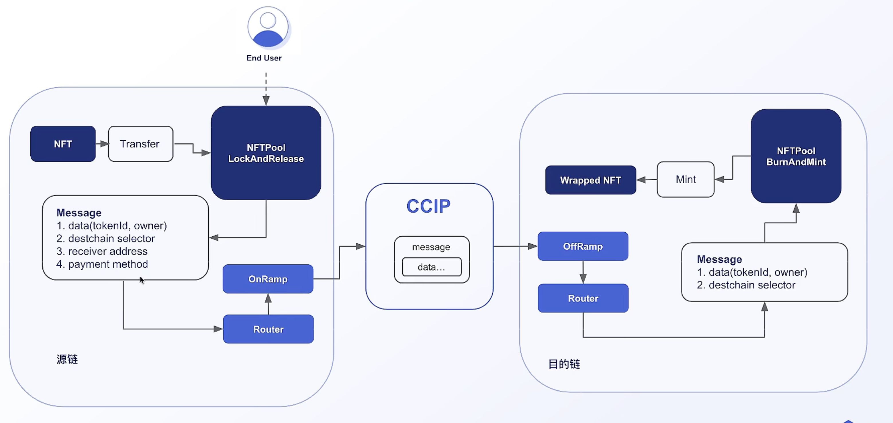

# cross-chain NFT(Non-Fungible Token)
## init project
- `npm init -y`
- `npm i -D hardhat`
- `npx hardhat init`

## Build ERC721 project
- create MyToken sol with openzeppelin
    - [openzeppelin](https://www.openzeppelin.com/solidity-contracts)
    - `npm i -D @openzeppelin/contracts`
- metadata
    - [metadata standards](https://docs.opensea.io/docs/metadata-standards)
    - [filebase storage](https://filebase.com/)

## Chainlink CCIP
- [chain link ccip docs](https://docs.chain.link/ccip/tutorials/evm/send-arbitrary-data)
- `npm i -D @chainlink/contracts-ccip`

## env-enc
- `npm i -D @chainlink/env-enc`
- `npx env-enc set-pw`
- `npx env-enc set`

## deploy
- [hardhat-deploy](https://github.com/wighawag/hardhat-deploy-ethers#readme)
    - `npm install --save-dev @nomicfoundation/hardhat-ethers ethers hardhat-deploy hardhat-deploy-ethers`
- [chainlink local](https://github.com/smartcontractkit/chainlink-local/tree/main)
    - `npm i -D @chainlink/local`
- [get chainId](https://chainlist.org/)
- [get ccip router and linkTokenAddr](https://docs.chain.link/ccip/directory/testnet)

## test

## task
- [hardhat-deploy companion network](https://github.com/wighawag/hardhat-deploy?tab=readme-ov-file#companionnetworks)